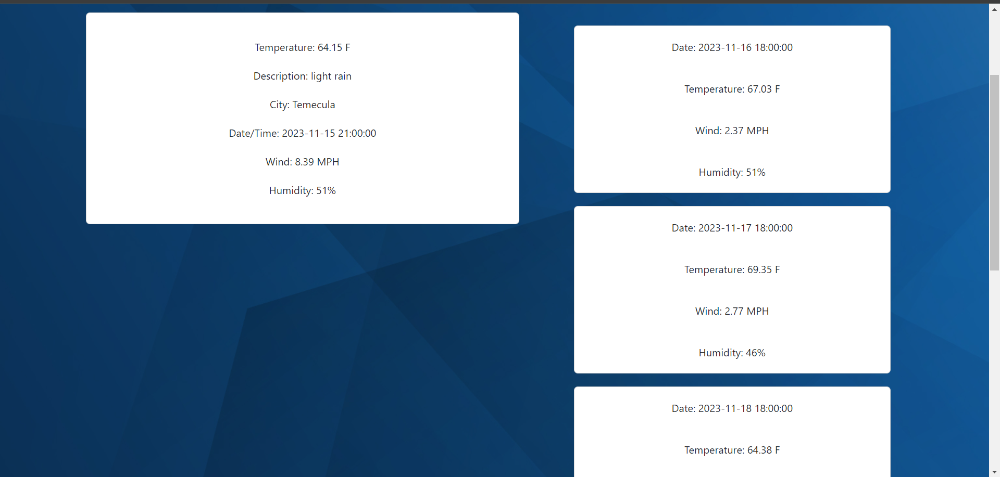

# Sweater-Weather

## Description

This weather application intakes a city value and processes through the openweather API to retrieve valuable weather information for the client. Weather is a variable in everyone's lives and so it is imperative to have knowledge of the weather on a daily to 5 day forecast basis. I was able to implement the API and track the following metadata to retrieve it through the API's array.

## Installation

You may possible need to input your own API key through the openweater website.

## Usage

Provide instructions and examples for use. Include screenshots as needed.

To add a screenshot, create an `assets/images` folder in your repository and upload your screenshot to it. Then, using the relative file path, add it to your README using the following syntax:

Simply input the city that you want weather information from

Consequently we will see the weather information propagate for current weather and a 5 day forecast

You will also have your inputs saved in the dropdown history button.

## Credits

Coding instructions and assistance from fellow UCB bootcamp student and friend,
https://github.com/song-richard

<a href="https://www.freepik.com/free-vector/modern-abstract-blue-transparent-crystal-pattern-background_15681036.htm#page=2&query=abstract%20background&position=49&from_view=keyword&track=ais">Image by vector_corp</a> on Freepik

## License

MIT License

Copyright (c) 2023 Pakapong Mongkol

Permission is hereby granted, free of charge, to any person obtaining a copy
of this software and associated documentation files (the "Software"), to deal
in the Software without restriction, including without limitation the rights
to use, copy, modify, merge, publish, distribute, sublicense, and/or sell
copies of the Software, and to permit persons to whom the Software is
furnished to do so, subject to the following conditions:

The above copyright notice and this permission notice shall be included in all
copies or substantial portions of the Software.

THE SOFTWARE IS PROVIDED "AS IS", WITHOUT WARRANTY OF ANY KIND, EXPRESS OR
IMPLIED, INCLUDING BUT NOT LIMITED TO THE WARRANTIES OF MERCHANTABILITY,
FITNESS FOR A PARTICULAR PURPOSE AND NONINFRINGEMENT. IN NO EVENT SHALL THE
AUTHORS OR COPYRIGHT HOLDERS BE LIABLE FOR ANY CLAIM, DAMAGES OR OTHER
LIABILITY, WHETHER IN AN ACTION OF CONTRACT, TORT OR OTHERWISE, ARISING FROM,
OUT OF OR IN CONNECTION WITH THE SOFTWARE OR THE USE OR OTHER DEALINGS IN THE
SOFTWARE.

## Features

Display current weather and 5 day forecast.
